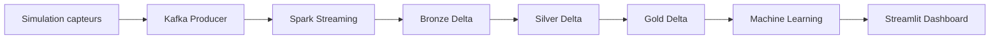

# 🌿 Rapport de Cycle Projet : GreenIoT-MA
**Pipeline End-to-End : IoT · Lakehouse · Machine Learning**

Ce document détaille chaque étape technique du cycle de vie du projet GreenIoT-MA, de la collecte de données brutes jusqu'à la visualisation prédictive.

---

## 🏗️ 1. Architecture Globale du Cycle
Le projet suit un cycle de données en "boucle fermée" où les capteurs alimentent un Lakehouse pour entraîner des modèles qui optimisent ensuite la consommation réelle.

---

## 📡 2. Acquisition & Simulation : Le Cœur de la Donnée
Le cycle débute dans le module `01_simulation`. GreenIoT-MA utilise une approche hybride pour garantir une fidélité maximale aux conditions réelles d'un Data Center marocain.

### 2.1. Modélisation Solaire (Dakhla Smart Campus)
Le `SolarSensor` simule la production d'un champ photovoltaïque de 500 kW.
*   **Algorithme Circadien** : La production suit une courbe sinusoïdale basée sur l'heure locale : 
    $f(h) = \max(0, \sin(\pi \times \frac{h - 6}{12}))$
*   **Irradiance en temps réel** : Couplage avec l'**API Open-Meteo** (coordonnées de Dakhla) pour obtenir l'irradiation directe ($W/m^2$).
*   **Effet Thermique** : La température des panneaux est calculée selon l'irradiance : $T_{panel} = 25°C + (\text{irradiance} \times 0.02) + \text{noise}$.

### 2.2. Simulation des Serveurs (IT Load)
Le `ServerSensor` modélise la consommation électrique d'un rack (max 90 kW).
*   **Profil de Charge (UCI Proxy)** : Utilisation du dataset **UCI Individual Household Power Consumption** pour simuler les pics de demande.
*   **Pattern de Bureau** : Un facteur de charge multiplicatif est appliqué entre 8h et 20h pour simuler l'activité de l'administration et des entreprises.
*   **Corrélation Ressources** : La consommation électrique est directement liée au $\%$ CPU. La température du processeur est ensuite simulée par : $T_{cpu} = 35°C + (\frac{\text{CPU}}{100} \times 25°C)$.

### 2.3. Refroidissement & Efficacité (PUE)
Le `CoolingSensor` simule les climatiseurs industriels (CRAC).
*   **Impact Environnemental** : La température extérieure ($T_{ext}$) de Dakhla (via Open-Meteo) influence le PUE.
*   **Formule du PUE** : Calculé dynamiquement pour refléter l'effort du système de refroidissement :
    $PUE = 1.3 + 0.15 \times \frac{T_{ext} - 20}{20} + \text{gauss}(0, 0.05)$
*   **Calcul de Puissance Totale** : $P_{total} = P_{it} \times PUE$.

### 2.4. Injection d'Anomalies
Pour entraîner les modèles de détection, le simulateur injecte aléatoirement (~2% de probabilité) des comportements anormaux :
*   **Fuite de CPU** : Pic soudain de charge à 100% sans raison métier.
*   **Panne de ventilateur** : Élévation brusque de la température sans augmentation de la consommation électrique.

### 2.5. Transport & Messagerie (Kafka Producer)
Une fois simulée, la donnée n'est pas simplement affichée ; elle est injectée dans le bus de messages en temps réel via `kafka_producer.py`.
*   **Routing Typé** : Un dictionnaire de mapping (`TOPIC_MAP`) dirige chaque flux vers son topic dédié (`greeniot.solar`, `greeniot.servers`, etc.), facilitant le traitement parallèle par Spark.
*   **Fiabilité de l'Acquisition** : 
    *   `acks="all"` : Garantit que le message est répliqué sur tous les brokers Kafka avant validation.
    *   `compression_type="gzip"` : Réduit la bande passante utilisée, crucial pour les déploiements IoT à grande échelle.
    *   `linger_ms=10` : Regroupe les messages par petits lots pour optimiser le débit sans sacrifier la latence.

### 2.6. Ingestion Hybride & Datasets de Référence
Pour aller au-delà d'une simple simulation mathématique, le système est conçu pour ingérer des fichiers industriels volumineux.
*   **UCI Dataset (IT Load)** : Ce dataset contient des relevés à la minute sur 4 ans. Le simulateur l'utilise comme **Baseline temporelle**. Si la maison consomme 2 kW, nous appliquons un facteur d'échelle multiplicateur de 10x à 30x pour simuler une rangée de serveurs Blade.
*   **ASHRAE (Thermal Efficiency)** : Les données de refroidissement (`cooling`) s'appuient sur le dataset Kaggle ASHRAE. Les compteurs d'eau glacée (chilled water) sont utilisés pour simuler les flux thermiques des échangeurs du Data Center.
*   **Mécanisme de Lecture** : Le script de simulation utilise des **Readers non-bloquants**. Si un fichier dataset est présent dans `data/`, il prend le relais sur les sinusoides aléatoires, garantissant des patterns "vrais" (saisonnalité, comportement humain).

> [!IMPORTANT]
> Cette approche hybride permet de tester les modèles de Machine Learning sur des comportements réels avant même d'avoir installé des capteurs physiques sur site.

*Capture : Log du générateur montrant la variété des types de capteurs.*

---

## 🚀 3. Ingestion & Streaming (Bronze)
Les données sont publiées dans trois topics Kafka : `greeniot.servers`, `greeniot.solar`, et `greeniot.cooling`.

*   **Spark Structured Streaming** : Le script `spark_streaming.py` consomme ces flux en continu.
*   **Couche Bronze** : Les données sont stockées au format **Delta Lake** sur un stockage objet **MinIO**. Cette couche conserve l'historique brut avec un timestamp d'ingestion.

---

## 💎 4. Raffinement Medallion (Silver & Gold)
C'est ici que la donnée brute devient une information exploitable pour l'IA.

### Couche Silver : Nettoyage
Le script `bronze_to_silver.py` effectue :
1.  **Casting** des colonnes (Double, Timestamp).
2.  **Déduplication** basée sur les IDs de capteurs et les dates.
3.  **Filtrage des anomalies** évidentes (ex: température négative impossible, pics de conso aberrants).

### Couche Gold : Feature Engineering
Le script `silver_to_gold.py` prépare les données pour le Machine Learning :
*   **Encodage Cyclique** : Transformation des heures (0-23) en `sin/cos` pour que le modèle comprenne que minuit est proche de 23h.
*   **Lag Features** : Création de colonnes $T-1$, $T-3$, $T-6$ pour donner au modèle une mémoire du passé immédiat.
*   **Rolling Windows** : Moyennes mobiles sur 12 et 24 heures pour capturer les tendances lourdes.

---

## 🤖 5. Machine Learning & Intelligence
Une fois les données en couche Gold, le cycle passe à la phase de modélisation :

1.  **Entraînement** : Utilisation de **XGBoost** et **LSTM** (Réseaux de neurones récurrents) pour prédire la consommation IT à $H+1$.
2.  **Détection d'Anomalies** : Un modèle **XGBoost Supervisé** apprend et surveille les déviations (ex: un serveur qui chauffe trop par rapport à sa charge CPU).
3.  **Optimisation** : Un algorithme compare la prédiction solaire et la prédiction IT pour suggérer un décalage des tâches batch vers les heures de forte production renouvelable.

*Capture : Évolution de la perte (loss) pendant l'entraînement des modèles.*

---

## 📊 6. Pilotage & Visualisation (Dashboard)
Le cycle se termine par l'interface utilisateur Streamlit (`05_dashboard`) :

*   **Monitoring Live** : Lecture directe de la couche Bronze/Silver pour voir l'état instantané du Data Center.
*   **Analyses Prédictives** : Affichage des prédictions générées par les modèles ML stockés (dossier `models/`).
*   **Optimisation** : Recommandations actionnables pour les administrateurs pour réduire le PUE (Power Usage Effectiveness).

*Capture : Visualisation des pics solaires versus consommation réelle.*

---

## 🛠️ Stack Technique Récapitulative
*   **Messaging** : Apache Kafka
*   **Traitement** : PySpark (Streaming & Batch)
*   **Stockage** : Delta Lake + MinIO (S3)
*   **ML** : Scikit-learn, XGBoost, MLflow
*   **UI** : Streamlit & Plotly
