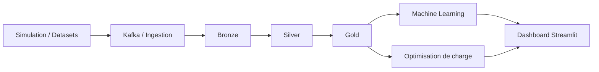

# Rapport de cycle projet : GreenIoT-MA

Ce document decrit le cycle technique du projet GreenIoT-MA depuis la generation des donnees jusqu'au pilotage energetique dans le dashboard.

## 1. Logique generale du projet

GreenIoT-MA cherche a repondre a une question simple :

`comment observer, predire et mieux piloter la consommation d'une infrastructure numerique alimentee en partie par le solaire ?`

Le projet combine :

- des flux IoT simules
- une architecture lakehouse Medallion
- des modeles de prediction et de detection d'anomalies
- une logique de `load shifting` pour les taches batch
- un dashboard de restitution

## 2. Simulation et acquisition

Le dossier `01_simulation/` produit les flux utilises dans le projet.

### 2.1. Solaire

La partie solaire simule une production photovoltaque journaliere qui varie selon l'heure et les conditions de generation retenues pour la demo.

Objectif :

- produire une courbe journaliere exploitable pour l'optimisation
- alimenter le dashboard avec une puissance solaire plausible

### 2.2. Serveurs

La simulation serveur represente une charge IT avec plusieurs variables :

- `power_kw`
- `cpu_pct`
- `ram_pct`
- `temp_c`

Le but est de reproduire un comportement proche d'une activite numerique reelle, avec des variations de charge et de temperature.

### 2.3. Jeux de donnees de reference

Le projet peut aussi s'appuyer sur des jeux de donnees externes, notamment UCI, afin de produire des profils temporels plus riches qu'une simple sinusoide.

## 3. Ingestion et couche Bronze

Les donnees peuvent etre poussees dans Kafka, puis consommees par :

- `02_ingestion/kafka_consumer.py`
- `02_ingestion/spark_streaming.py`

La couche Bronze conserve les enregistrements bruts avec leur temporalite.

Role de Bronze :

- centraliser les messages entrants
- garder l'historique brut
- servir de point de depart aux traitements suivants

## 4. Transformation vers Silver

Le script `03_lakehouse/bronze_to_silver.py` nettoie et enrichit les donnees.

Cette couche sert notamment a :

- normaliser les types
- dedoublonner les enregistrements
- calculer des indicateurs intermediaires
- produire un label heuristique d'anomalie pour les serveurs

Dans la version actuelle, les labels d'anomalie sont construits a partir d'une combinaison de signaux :

- temperature elevee
- saturation CPU
- instabilite de puissance
- derive soutenue de charge

L'objectif n'est pas de dire que ce label est la verite terrain, mais de fournir une base d'apprentissage plus realiste qu'un marquage arbitraire.

## 5. Transformation vers Gold

Le script `03_lakehouse/silver_to_gold.py` prepare les donnees pour le machine learning et la visualisation.

La couche Gold contient des variables plus riches comme :

- moyennes glissantes
- ecarts-types
- lags
- encodage cyclique de l'heure et du jour
- variables utiles a la prediction et a l'analyse

Cette couche est celle qui alimente principalement :

- `train_prediction.py`
- `train_anomaly.py`
- le dashboard Streamlit

## 6. Prediction de consommation

Le projet compare deux approches :

- `XGBoost`
- `LSTM`

Le script `04_ml/train_prediction.py` entraine les modeles sur les features Gold pour predire la consommation IT.

Les metriques suivies sont :

- `MAE`
- `RMSE`
- `R2`
- `MAPE`

L'interet de cette double approche est de confronter :

- un modele tabulaire robuste et interpretable
- un modele sequence capable de mieux exploiter la dynamique temporelle

## 7. Detection d'anomalies

Le script `04_ml/train_anomaly.py` entraine un modele supervise `XGBoost`.

La logique actuelle du projet est la suivante :

1. construire un label heuristique dans Silver
2. exclure de l'entrainement les variables qui fabriquent directement ce label
3. calibrer un seuil de decision sur validation
4. evaluer precision, recall et F1

Ce point est important : le projet ne presente plus la detection d'anomalies comme un simple `Isolation Forest` de demonstration. La version actuelle cherche une evaluation plus honnete et plus defendable.

## 8. Principe du load shifting

Le `load shifting` consiste a deplacer des taches batch vers les moments ou l'energie solaire est la plus disponible.

Dans GreenIoT-MA, cela signifie :

- ne pas lancer certaines taches au hasard
- choisir le meilleur moment de la journee solaire
- reduire la part d'energie reseau

Le module `04_ml/optimize_load.py` :

- construit un profil solaire par slots de 15 minutes
- detecte la meilleure fenetre solaire
- evalue plusieurs placements de taches
- choisit le planning qui maximise la couverture solaire

Les taches manipulees dans le dashboard sont des charges batch comme :

- entrainement ML
- backup Delta Lake
- export BI
- compression Bronze
- synchronisation MinIO

Chaque tache est decrite par :

- une duree
- une priorite
- une puissance requise

## 9. Dashboard Streamlit

Le dashboard actuel comporte trois pages :

### Monitoring

Cette page sert a la supervision temps reel :

- etat CPU
- temperature
- puissance
- telemetrie recente

### Predictions

Cette page compare les sorties des modeles et affiche les artefacts si ceux-ci sont disponibles.

### Optimization

Cette page est dediee au pilotage journalier :

- selection d'un jour parmi les 5 derniers disponibles
- calcul des KPI solaires de la journee
- affichage de la fenetre optimale
- planification des taches batch

Les KPI importants sont :

- `Pic de production`
- `Moyenne diurne`
- `Energie du jour`
- `CO2 potentiel du jour`

Ils sont calcules a partir de la meme journee de reference pour eviter toute incoherence entre les chiffres et le graphe.

## 10. Valeur ajoutee du projet

Le projet ne se limite pas a decrire un etat energetique. Il cherche aussi a produire une recommandation actionnable :

- quand executer une charge flexible
- quelle part peut etre couverte par le solaire
- quel potentiel carbone peut etre evite

Cette dimension decisionnelle rend le projet plus professionnel qu'un simple dashboard descriptif.

## 11. Limites actuelles

Quelques limites restent presentes :

- les transformations lakehouse ne sont pas encore totalement incrementales
- les taches d'optimisation restent des charges batch parametrees dans l'interface
- la qualite live depend de la disponibilite des services Kafka, MinIO et Delta

## 12. Perspectives

Les evolutions les plus naturelles sont :

- passer les transformations en `merge` incrementiel
- connecter l'optimisation a un vrai ordonnanceur de jobs
- integrer le cout horaire de l'electricite
- produire un indicateur de ROI energetique et carbone

## Conclusion

GreenIoT-MA est un projet de cycle complet qui relie data engineering, machine learning et optimisation energetique. Sa force principale est de transformer des donnees techniques en aide a la decision, notamment par la prediction et le load shifting solaire.
